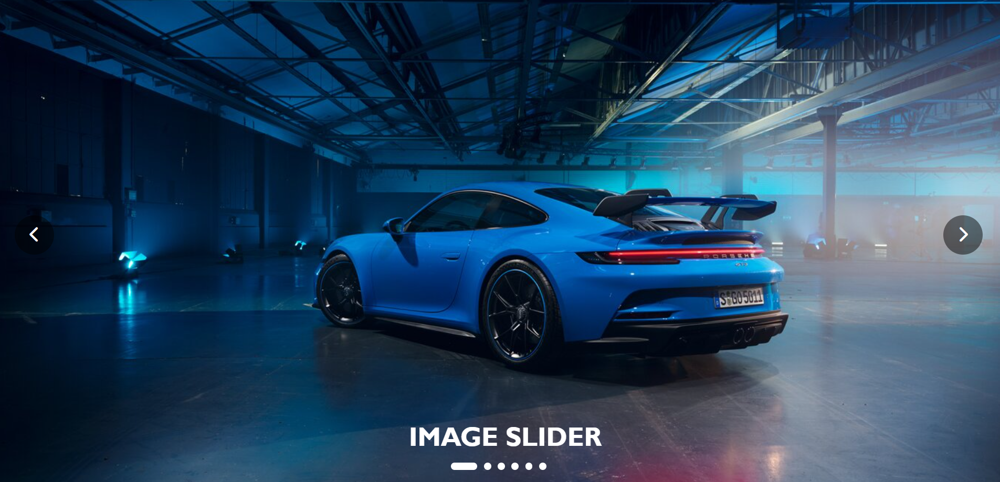

# 🌠 IMAGE SLIDER

A **responsive**, **feature-rich** image slider built using **vanilla JavaScript**, **HTML5**, and **CSS3**. Perfect for modern websites, landing pages, or portfolios.

---

## 🔧 Features

- ✅ Smooth sliding transitions
- ✅ Auto-play with customizable interval (default: 3 seconds)
- ✅ Manual navigation via next/previous controls
- ✅ Dot indicators for direct navigation
- ✅ Fully responsive and mobile-friendly
- ✅ Clean, customizable UI
- ✅ Scalable to any number of images

---

## 📽️ Demo

🔗 [Click here for Live Demo](https://4rshxnth.github.io/IMAGE-SLIDER/)

> **Here’s a preview of the image-slider**



---

## 🚀 Installation

Clone the repository:

```bash
git clone https://github.com/yourusername/image-slider.git
cd image-slider
```

Open `index.html` in your browser to preview the slider.

---

## 📦 Usage

To integrate this slider into your own project:

1. Copy the following files:
   - `index.html` (only the slider HTML block)
   - `styles.css`
   - `script.js`

2. Create an `/Images` directory and add your image assets.

3. Update the `src` paths inside your HTML accordingly.

---

## 📁 Project Structure

```plaintext
image-slider/
├── index.html          # HTML layout
├── styles.css          # Styling file
├── script.js           # Slider logic
└── Images/             # Image assets
    ├── slider icon.png
    └── *.jpg / *.png   # Your slider images
```

---

## ⚙️ How It Works

1. Images are placed side-by-side in a horizontal container.
2. JavaScript dynamically tracks the current index.
3. Navigation buttons and dot indicators control image display.
4. Auto-play is managed using `setInterval()`.
5. CSS `transform: translateX` handles the sliding motion.

---

## 🧠 Core JavaScript Functions

- `reloadSlider()`: Updates slide position and active dot
- Event listeners: 
  - Navigation arrows (`.next`, `.prev`)
  - Dot clicks (`.dot`)
- `resize` event listener ensures responsiveness across breakpoints
- `setInterval()` automates slideshow rotation

---

## 🎨 Customization

### ⏱️ Change Auto-Slide Timing

In `script.js`:

```js
let refreshInterval = setInterval(() => { next.click() }, 3000);
// Change 3000 (ms) to adjust the delay
```

### 🖼️ Add More Images

1. Add a new image block inside `.slider`:

```html
<div class="item">
  
</div>
```

2. Add a matching `<li>` in the dot indicators list:

```html
<ul class="dots">
  <!-- Existing -->
  <li></li> <!-- New -->
</ul>
```

### 🎨 Style Customizations

Modify `styles.css` to:

- Change color themes
- Resize buttons and images
- Update animation effects
- Redesign the dot indicators

---

## 🙏 Acknowledgments

- [Font Awesome](https://fontawesome.com/) for the navigation icons  
  > *(Ensure you've included the Font Awesome CDN in your HTML)*

```html
<link rel="stylesheet" href="https://cdnjs.cloudflare.com/ajax/libs/font-awesome/6.0.0/css/all.min.css">
```
---

## 🌐 Browser Support

Tested and works smoothly on:

- ✅ Chrome (latest)
- ✅ Firefox (latest)
- ✅ Safari (latest)
- ✅ Microsoft Edge
- ✅ Opera

---

## 📜 License

This project is licensed under the **MIT License**. See the `LICENSE` file for full terms.

---

